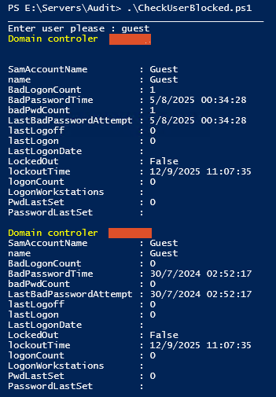

## Check whether the user is blocked on any domain controller.
### Description

The **check_User_blocked.ps1** PowerShell script in this repository allows you to search all domain controllers to see if a user is locked out.
You can enter *sAMAccountName*, *DistinguishedName*, *objectSid* or *objectGUID*.

Lists
 - *propParam* properties to look for in each domain controller.
 - *propSelect* properties to display at output. [Converts](https://www.epochconverter.com/ldap) the 18-digit LDAP/FILETIME timestamps BadPasswordTime, LastLogon, LockoutTime and PwdLastSet to human-readable dates. The timestamp is the number of 100-nanosecond intervals since 1 January 1601 UTC (1 nanosecond = one billionth of a second).
 - *getParams* parameters that should be passed to the [Get-ADUser](https://learn.microsoft.com/en-us/powershell/module/activedirectory/get-aduser?view=windowsserver2025-ps) cmdlet

[Error handling](https://github.com/devops-collective-inc/big-book-of-powershell-error-handling-spanish/blob/master/manuscript/controlling-error-reporting-behavior-and-intercepting-errors.md)
 - *ErrorVariable = $errLog* a list of errors that have occurred since the command was called is stored in error.log.
 - *ErrorAction = "SilentlyContinue"* errors are not displayed in the console. 
 - *Try/Catch* error handling Terminating

